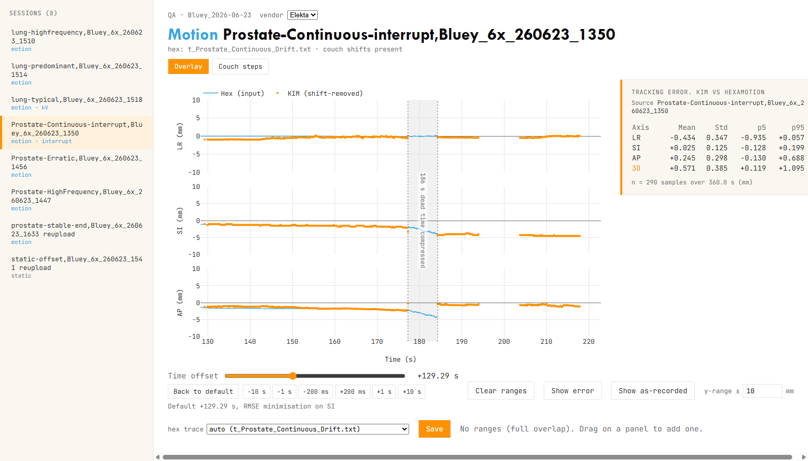

---

# KIM QA Analysis

A browser-based application for analyzing KIM (Kilo-voltage Imaging for Motion management) QA
data against HexaMotion/6DoF-robot ground truth. Point it at a results root and it discovers
every session folder, classifies it (static, motion, or interrupted acquisition), and serves an
interactive overlay view for QA sign-off.

## Download

Grab the standalone Windows executable from the public mirror:
**[github.com/kkaan/kim-qa/releases/latest](https://github.com/kkaan/kim-qa/releases/latest)** -
download `KIM-QA-Analysis-Windows.zip`, extract, run `KIM-QA-Server.exe`. No install, no
Python.

## Quick start

Run from source:
```bash
uv sync --extra server
uv run python -m kim_qa.server --root <results root>
```

Or run the built executable (`python_app/dist/KIM-QA-Server.exe`):
```bash
KIM-QA-Server.exe --root <results root>
```

Omit `--root` to pick the folder from a dialog. Use `--vendor Varian` for Varian machines
(flips the vertical-to-AP couch-shift sign; default Elekta).



Verified end-to-end against real Bluey phantom data; see
`docs/specs/2026-07-20-webapp-gui-revamp-verification.md` for the checklist and results.

## Features

- **Session sidebar** - batch discovery of every session under the root, with kind badges
  (static / motion / interrupt / kV), saved-state checkmarks, and greyed rows for unparsable
  folders. New folders appear on browser refresh.
- **Overlay view** - three stacked LR/SI/AP panels (default ±10 mm, editable), KIM detections
  vs the HexaMotion input trace, time-offset slider with nudge buttons and RMSE auto-fit,
  drag-to-select analysis ranges, live metrics card (mean/std/p5/p95 + 3D), error-residual
  mode, and a gantry-angle top axis.
- **Interrupt handling** - multi-segment acquisitions are stitched with vendor-signed couch
  corrections; dead-time gaps compress visually with per-panel couch-delta annotations; a
  "Show as-recorded" ghost overlays the uncorrected trace.
- **Couch-steps view** - raw trajectory vs expected per-segment step levels with the
  commanded-shift table (for sessions with `couchShifts.txt`).
- **kV frame preview** - hovering a KIM point shows the actual kV crop with crosshair and
  detected-marker ring (when a `KIM-KV/` folder is present).
- **QA outputs** - Save writes `overlay.png` per session, persists tuned offsets/ranges to
  `_overlay_state.json`, and regenerates a combined `summary.md` with canonical Python metrics.

## Installation

### Requirements
- Python 3.11 or higher
- [uv](https://docs.astral.sh/uv/) package manager

### Setup

1. Install [uv](https://docs.astral.sh/uv/). It manages the Python interpreter, the
   virtual environment, and dependencies for you — there is no separate `pip install` step.
2. From the repo root, sync the environment:
   ```bash
   uv sync --extra server
   ```
   This reads `pyproject.toml`, creates a `.venv/` if one doesn't exist, and installs the
   exact versions pinned in `uv.lock` (a reproducible install). The core dependencies
   (`numpy`, `pandas`, `scipy`) install the `kim_qa` analysis package; `--extra server` adds
   the web server dependencies (`fastapi`, `uvicorn`, `pillow`). Omit the flag if you only
   need the analysis library. Use `--extra tools` for the matplotlib-based scripts in
   `tools/`.

Frontend development additionally needs Node 20+: `cd webapp && npm install && npm run dev`
(the Vite dev server proxies `/api` to `127.0.0.1:8765`).

## Usage

1. **Launch** the server against a results root (see Quick start); your browser opens the UI.
2. **Pick a session** from the sidebar. Motion sessions auto-match their HexaMotion trace by
   folder name; use the "hex trace" dropdown to override.
3. **Align**: the time offset is auto-fitted by RMSE (SI axis, or LR for LR-dominant traces);
   refine with the slider and nudge buttons.
4. **Select ranges** by dragging on a panel; the metrics card updates live.
5. **Save**: writes `overlay.png` into the session folder, persists the tuned state, and
   regenerates the root-level `summary.md`.

## Application Architecture

### Main Components

- **`src/kim_qa/server/`**: FastAPI app - session discovery, live `OverlayPayload` /
  `CouchShiftPayload` assembly (vendor-signed couch corrections, raw-timebase interrupts),
  on-the-fly kV frame crops, state persistence, and `summary.md` generation.

- **`webapp/`**: Vite + React + Plotly frontend - vendored `kim-overlay` / `kim-couch-shift`
  widgets from the presentation deck, recomputing metrics client-side (`webapp/src/lib.ts`,
  kept numerically identical to the Python metrics and guarded by a golden-file test).

- **`src/kim_qa/`**: Installable analysis package (imported by the server and tools)
  - `io/centroid.py` — `parse_centroid_file()`: Extract seed and isocenter coordinates
  - `io/trajectory.py` — `parse_trajectory_file()`: Process KIM trajectory data
  - `io/couch.py` — `parse_couch_shifts()`: Extract couch shift values (Elekta/Varian AP-sign logic)
  - `io/kim_batch.py` — `parse_kim_data()`: Parse multiple KIM data files
  - `io/robot.py` — `parse_robot_file()`: Load robot trace data
  - `io/hexamotion.py` — `parse_hexamotion_trace()`: HexaMotion / 6DoF-robot ground-truth traces (3-column commanded `trajectory` traces and 7-column `_robot` traces)
  - `io/ground_truth.py` — `parse_ground_truth_file()`: auto-detecting ground-truth loader (HexaMotion trace or comma-delimited robot file)
  - `coords.py` — coordinate transforms (centroid → LR/SI/AP in mm)
  - `metrics.py` — `calculate_metrics()`: Compute statistical metrics
  - `interrupt.py` — `process_interrupt_data()`: Align and compare KIM vs Robot data
  - `dynamic.py` — `align_trajectory_to_truth()`: KIM vs moving ground-truth alignment + deviation metrics

### Data Flow

**Static Analysis:**
```
Centroid File → Expected Centroid Calculation
                        ↓
Trajectory File → Deviation Calculation → Metrics → Results
```

**Interrupt Analysis:**
```
Trajectory Folder → KIM Data Parsing
Couch Shifts File → Shift Extraction     → Data Alignment → Comparison → Metrics
Robot File → Robot Data Parsing
```

## File Formats

### Input Files

- **Centroid Files**: Text files containing seed and isocenter coordinates
- **Trajectory Files**: CSV/TXT files with time-series position data
- **KIM Data Files**: `MarkerLocationsGA_CouchShift_*.txt` format
- **Couch Shifts**: `couchShifts.txt` with VRT, LNG, LAT shifts
- **Robot Files**: 7-column format with timestamp and position data

### Output Files

- **Metrics.txt**: Statistical analysis results (mean, std, percentiles)
- **Trace_Plot.png**: Visualization of trajectory data
- **Interrupt_Metrics.txt**: Interrupt analysis results with pass/fail status
- **Interrupt_Plot.png**: KIM vs Robot comparison plot

## Technical Details

- **UI**: React + Plotly in the browser, served by FastAPI/uvicorn on localhost
- **Data Processing**: NumPy/Pandas in Python; metrics mirrored in TypeScript for live updates
- **Coordinate System**: LR (Left-Right), SI (Superior-Inferior), AP (Anterior-Posterior)

## Public release mirror (kkaan/kim-qa)

Development happens in a private repository; the public face is
**[github.com/kkaan/kim-qa](https://github.com/kkaan/kim-qa)**, which serves three things:
the downloadable executable (Releases), the minimal runnable source, and the GitHub Pages
landing page. The mirror is an artifact, not a fork: its `main` is overwritten on every
release publish here, and nobody develops there.

How it works:

- `tools/release_closure.txt` is the explicit allowlist of what ships publicly (analysis
  package, server, webapp source, tests, README, landing pages). A line that matches nothing
  fails the build, so closure drift is loud, never silent.
- `tools/build_release_mirror.py` stages the closure into a git-ignored `release/` tree.
- `tools/smoke_test_exe.py` boots the built exe against a synthetic session root and asserts
  the API before anything is allowed to publish.
- `.github/workflows/build-release.yml` chains it on every published release: build frontend
  -> PyInstaller -> smoke test -> stage mirror -> push to kim-qa `main` -> create the public
  release with the exe attached. Cross-repo auth uses the `MIRROR_TOKEN` Actions secret
  (fine-grained PAT, Contents read/write on kim-qa; expires 2027-07-20).

To change what is public, edit `tools/release_closure.txt` - nothing else.

## Building Executables

### Automated Builds (GitHub Releases)

When you create a new release on GitHub, the workflow automatically:
1. Builds the frontend and the standalone Windows executable (PyInstaller), smoke-tests it
2. Packages it as a ZIP file and uploads it to the private release
3. Mirrors the minimal source and publishes the same ZIP as a release on kkaan/kim-qa

To trigger an automated build:
```bash
git tag v1.0.0
git push origin v1.0.0
# Then create a release from the tag on GitHub
```

### Manual Build (Local)

To build the executable locally:

1. Build the frontend, then sync the environment with server and dev extras:
```bash
cd webapp && npm ci && npm run build && cd ..
uv sync --extra server --extra dev
```

2. Build using the spec file (from the `python_app` directory, matching CI):
```bash
cd python_app
uv run pyinstaller KIM-QA-Server.spec
```

3. The executable will be in `python_app/dist/KIM-QA-Server.exe`

## Legacy MATLAB Code


The original MATLAB implementations are still available in the repository:
- `Elekta/App_Static_loc.mlapp` - Static localization MATLAB app
- `Elekta/Staticloc.m` - Static localization MATLAB script
- See respective folders for linac-specific implementations (Elekta, Varian Truebeam)

## Interactive kV Imaging Simulator

An interactive browser-based simulator demonstrating depth-dependent magnification, geometric penumbra, and divergent beam geometry in kV imaging:

**[Launch kV Imaging Simulator](https://kkaan.github.io/KIM-QA-Analysis/kv-simulator.html)**

Features adjustable SAD, SID, focal spot size, gantry angle, and target translation controls with real-time BEV scene and detector projection views.

## Related tools

**[KIM-QA Reporter](https://github.com/kkaan/kim-reporter)** (private) — companion desktop app for clinical PDF reporting of KIM-guided couch corrections. Reads the same trajectory log format and centroid files, renders interactive deviation plots, and exports A4 reports with intervention summary tables and physicist notes.

## References

For detailed information about the KIM QA analysis methodology, see:
- `KIM QA publication.pdf` - Analysis procedure documentation
- `KIM commissioning report for Nepean Cancer Center.pdf` - Commissioning details
